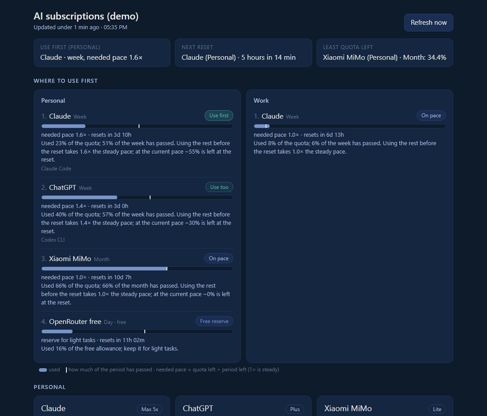
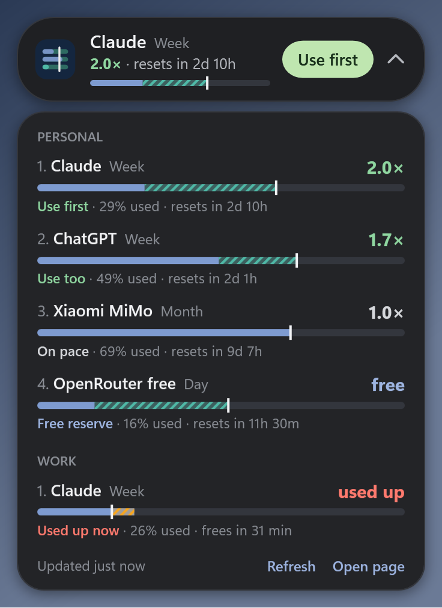

# Token Pace

**Which AI subscription should you use first?** Token Pace reads the usage limits of
your AI plans (ChatGPT/Codex, Claude, OpenRouter's free tier, anything you type in by
hand) and ranks them by how much quota you are about to leave on the table before each
reset. It is a small self-hosted page, a JSON API and an Android home-screen widget.
On Windows there is also a floating mini window with a tray icon.



The page answers in three seconds: one tile per group names the subscription to use
first, a timeline shows every reset in the next three days, and each ranked row has a
single bar. The blue fill is the quota used, the white tick is how much of the period
has passed, and the hatched band between them is slack you would lose at the reset
(teal) or use ahead of pace (amber). Short windows such as Claude's 5 hours sit under
each row as chips, and "Why" explains the numbers.

## How the ranking works

Every plan has windows that reset: 5 hours, a week, a month, a day. For each
subscription Token Pace takes its longest window and compares the share of quota left
with the share of time left:

> **needed pace** = % of quota left ÷ % of the period left

The steady pace is the rate that would spend 100% of the quota evenly over the whole
period. At 1× what is left matches the time left. At 3× you would have to spend at
three times that steady rate from now on, or lose the rest at the reset. So:

| Verdict | Meaning |
|---|---|
| **Use first** | the highest needed pace in its group, above 1.15× |
| **Use too** | other subscriptions above 1.15× |
| **On pace** | 0.85× to 1.15× |
| **Save** | below 0.85×: at this rate the quota runs out before the reset |
| **Used up now** | a short window (say, Claude's 5 hours) is exhausted; it moves to the end until it frees up |
| **Free reserve** | free tiers, kept at the end for light tasks |

Subscriptions are ranked within groups (for example *Personal* and *Work*), each with
an optional logo.

## Quick start

To let your AI coding agent install it, ask it to follow [INSTALL.md](INSTALL.md):
*"Install Token Pace by following https://raw.githubusercontent.com/LuizPiccini/tokenpace/main/INSTALL.md"*.

Python 3.11 or newer, no other dependencies.

```sh
git clone https://github.com/LuizPiccini/tokenpace && cd tokenpace
python -m tokenpace serve --demo          # synthetic data at http://localhost:8787
```

Or install the command: `pipx install git+https://github.com/LuizPiccini/tokenpace@v0.3.0`.

Then describe your own subscriptions:

```sh
cp config.example.toml tokenpace.toml     # or ~/.config/tokenpace/config.toml
python -m tokenpace check                 # validate
python -m tokenpace collect               # read everything once, print JSON
python -m tokenpace serve
```

## Providers

| `provider` | Reads | Notes |
|---|---|---|
| `codex` | ChatGPT plan limits (5 hours, week) with the Codex CLI login in `~/.codex/auth.json` | read-only; the login renews whenever you use Codex |
| `claude_code` | Claude plan limits (5 hours, week, per-model weeks) with the Claude Code login (`~/.claude/.credentials.json` or the macOS Keychain) | read-only by default, see below |
| `openrouter_free` | OpenRouter's daily allowance of `:free` model requests | needs an API key in an env var or file |
| `manual` | numbers you type on the page | for consoles without an API |
| `push` | readings sent by `tokenpace push` from another machine | for a work laptop or a second computer |
| `demo` | synthetic data | for trying things out |

The ChatGPT and Claude readers call the same undocumented usage endpoints the
official apps use. They can change without notice; when they do, the row shows an
error instead of wrong numbers.

**Claude logins expire after about 8 hours** and are renewed only when Claude Code
runs. If the machine running tokenpace does not use Claude Code every day, give
tokenpace its own login and let it renew that one:

```sh
CLAUDE_CONFIG_DIR=~/.config/tokenpace/claude claude auth login
```

```toml
[[subscriptions]]
id = "claude"
provider = "claude_code"
credentials_file = "~/.config/tokenpace/claude/.credentials.json"
refresh = true
```

Never point `refresh = true` at the login Claude Code itself uses: refresh tokens
rotate, and two programs renewing the same login will log one of them out. Renewal
uses Claude Code's OAuth client, so check that this fits Anthropic's terms for your
account.

## Running it all the time

- Linux: `contrib/systemd/tokenpace.service` (a user unit; `loginctl enable-linger`
  keeps it running after logout).
- macOS: `contrib/launchd/app.tokenpace.plist`.

State (the last readings) lives in `~/.local/state/tokenpace` (`%LOCALAPPDATA%\tokenpace`
on Windows).

## Reaching it from your phone

Token Pace listens on `127.0.0.1` unless you change `[server] host`. The simplest
safe setup is a private network such as [Tailscale](https://tailscale.com): bind to
the machine's tailnet address, or keep localhost and run
`tailscale serve --bg 8787`. If anyone else can reach the port, set a token
(`[server] token` or `TOKENPACE_TOKEN`); the API and the widget then require it, and
the page asks for it once (or open it as `http://host:8787/#token=…`). Do not expose
it to the public internet without a token and TLS.

Without a token, Token Pace only answers requests addressed to an IP address,
`localhost` or the machine's own name, which stops other web pages from reaching it
through DNS rebinding. If you open it by another DNS name (a Tailscale MagicDNS name,
say), list it in `[server] allowed_hosts` or set a token.

## Several machines

Subscriptions that live on another computer (a work laptop with its own Claude login,
say) are declared on the server with `provider = "push"`. The other machine runs the
same tool with its own config and sends the numbers:

```sh
tokenpace push --config laptop.toml --to http://my-server:8787 --token "$TOKENPACE_TOKEN"
```

Run it from cron or launchd every 10 minutes. Pushes always need the server's token.
Only numbers, reset times, plan names and the optional `--source` label travel;
logins stay on each machine.

## Android widget

The widget shows the same ranking on the home screen, with a scrollable list on
Android 12+ and a height-fitted list on older versions. Tapping the title refreshes;
tapping a row opens the page.

```sh
cd android
./gradlew assembleDebug        # build/outputs/apk/debug/tokenpace-widget-debug.apk
./gradlew testDebugUnitTest    # Robolectric tests
```

It needs the Android SDK (platform 34) and JDK 17. Install the APK, add the
**Token Pace** widget, and enter your server address (and token, if set). To offer the
APK from your own server, set `[android] apk` in the config; the page then links to
it, and the widget announces newer versions when `version_code` goes up. Group logos
appear in the widget when they are PNG, JPEG or WebP.

## Windows mini window

`tokenpace-mini.exe` keeps the answer on screen: a small pill just above the taskbar with
the plan to use first, its needed pace and reset, and the same pace bar as the page.
Click it to see every plan; drag it anywhere. A tray icon by the clock draws the top
plan's bar and opens a menu (refresh, open the page, settings, start with Windows,
reset position, quit). It reads `/api/widget` like the Android widget.



Download it from the [latest release](https://github.com/LuizPiccini/tokenpace/releases/latest),
run it, and enter the server address (and token, if set). It is a single file with nothing
to install, and stores its settings in `%APPDATA%\TokenPace\mini.json` with the token
encrypted for your Windows user.

The exe is not code-signed yet. Windows SmartScreen will ask for confirmation the first
time ("More info", then "Run anyway"), and PCs with **Smart App Control** turned on block
it outright, with no exception allowed.

To build it yourself, run `powershell -File windows/build.ps1`. It uses the C# compiler
and WPF that ship with Windows 10 and 11, so no SDK is needed. A copy you build yourself
is still unsigned.

## Development

```sh
python -m unittest discover -s tests -t .
```

A provider is a function `(subscription_config, now) -> {"windows": [...], "plan_label": ..., "message": ...}`
in `tokenpace/providers.py`, registered in `PROVIDERS`. Windows come from
`make_window(kind, used_percent, resets_at, seconds)`. Raise `ProviderError("unavailable", ...)`
when there is nothing to read and `ProviderError("error", ...)` when reading failed.
Providers must never log, print or return credentials.

Contributions, especially new providers, are welcome: see [CONTRIBUTING.md](CONTRIBUTING.md)
and open a **New provider** issue to start.

Token Pace is not affiliated with OpenAI, Anthropic, OpenRouter or any other provider.

## License

MIT, see [LICENSE](LICENSE).
